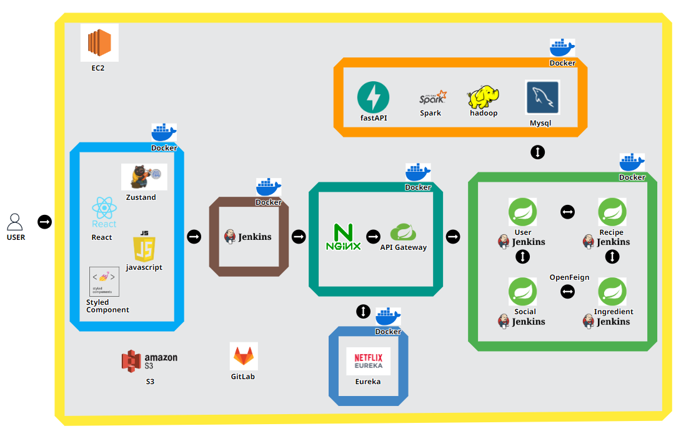
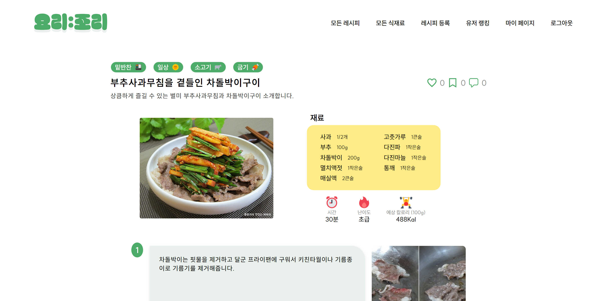
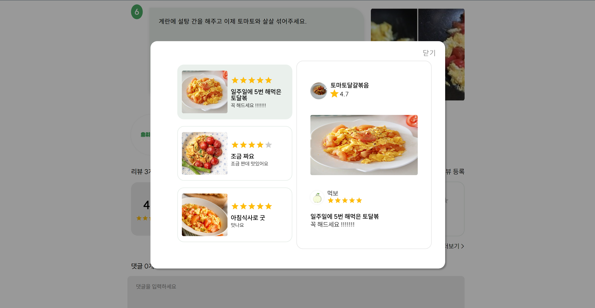
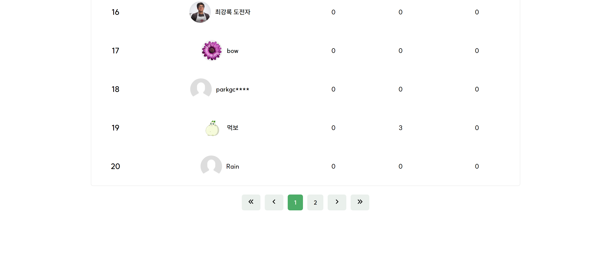

# 🍳 요리:조리 🍳

삼성 청년 소프트웨어 아카데미 11기 특화 프로젝트

## 📚 목차

- [🗓️ 프로젝트 개요](#️-프로젝트-개요)
  - [진행 기간](#진행-기간)
  - [팀 구성](#팀-구성)
- [📢 서비스 소개](#-서비스-소개)
- [🥳 서비스 설계](#-서비스-설계)
  - [기술 스택](#기술-스택)
  - [ERD](#erd)
  - [Wireframe](#wireframe)
  - [Architecture](#architecture)
  - [Docs](#docs)
- [🤗 기능 소개](#-기능-소개)
- [✨ 기대 효과](#-기대-효과)
- [⛏ 기술 소개](#-기술-소개)

## 🗓️ 프로젝트 개요

### 진행 기간

- 2024.08.23 ~ 2024.10.11 

### 팀 구성

[📎 Team Notion](https://www.notion.so/ineedalotofmoney/C206-75b122583009492eacf1d6147ad21937?pvs=4)

|                            김민주                            |                            박기창                            |                            남보우                            |                            이지영                            |                            신재건                            |                            김정민                            |
| :----------------------------------------------------------: | :----------------------------------------------------------: | :----------------------------------------------------------: | :----------------------------------------------------------: | :----------------------------------------------------------: | :----------------------------------------------------------: |
|  |  |  |  |  |  |
|                          팀장 , FE                           |                          BE , CI/CD                          |                              BE                              |                         BE, 빅데이터                         |                              FE                              |                              FE                              |

## 📢 서비스 소개

레시피를 고를 때 무엇을 고려하시나요 ? 

하나의 샐러드라는 요리를 먹더라도 제철재료가 들어가 있는지 재료의 가격은 저렴한지, 혹은 비싼지, 칼로리와 영양성분은 어떠한지, 검증된 레시피인지 요리의 난이도는 어떠한지, 그리고 주의할 알러지 성분이 포함되어 있는지를 모두 고려합니다.

지금까지 무의식적으로 선택해 왔던 이러한 레시피 어떠신가요? 하나의 요리라고 하더라도 너 많은것을 고려하고 있지는 않으신가요? 저희팀은 이러한 많은 체크리스트를 한번에 해결해 드리고 싶어 요리조리가 탄생하게 되었습니다. 

[🎞 서비스 소개 UCC  ](https://youtu.be/F8Fbwl86-w0)

## 🥳 서비스 설계

### 기술 스택

|               | Front                      | Back                                              |
| ------------- | -------------------------- | ------------------------------------------------- |
| **Language**  | JavaScript (ES6+)          | Java17, Python                                    |
| **IDE**       | Visual Studio Code         | IntelliJ, PyCharm                                 |
| **Framework** | React, Vite                | Spring Boot, Spring security, Spring JPA, FastAPI |
| **Library**   | zustand, styled-components |                                                   |

| BigData       | DB    |              CI/CD              |        Tools         |
| ------------- | :---- | :-----------------------------: | :------------------: |
| Hadoop, Spark | MySQL | AWS EC2, Docker, Nginx, Jenkins | GitLab, Jira, Notion |

### Wireframe

[📎 Figma Link](https://www.figma.com/design/YwBKgQXSF3vJPn6b7QtwtH/%EC%9A%94%EB%A6%AC%3A%EC%A1%B0%EB%A6%AC?t=H2GmQYVmY8gywv7N-0)

### Architecture

 

### Docs

[📎 API](https://www.notion.so/ineedalotofmoney/API-ae8c988dcd4145ca8caafa799685826c?pvs=4)  
[📎 기능 정의서](https://docs.google.com/spreadsheets/d/1rbCnRGxHd0k-HfZbR9sCeLqBtXB_axU8/edit?gid=443149680#gid=443149680)

###  활용 데이터 

[📎 활용 데이터 정리](https://drive.google.com/drive/folders/1wTdVTvmqUweOziOdVqhSfDwm5zatxjyW?usp=drive_link)
| 분류                 | 데이터 상세               | 형태   | 수집 방법           | 대상             | 팀코드 | 수집 및 활용 데이터 건수(반올림) | 수집 시간 |
| -------------------- | ------------------------- | ------ | ------------------- | ---------------- | ------ | -------------------------------- | --------- |
| 레시피 정보          | 카테고리별 레시피 데이터  | 텍스트 | 크롤링              | 모두의레시피     | C206   | 210,000                          | 3주       |
| 레시피 정보          | 계절별 추천 레시피 데이터 | 텍스트 | 크롤링              | 모두의 레시피    | C206   | 250                              | 1일       |
| 농수산물 및 식품정보 | 농수산물 가격 정보        | 텍스트 | Open ApI            | KAMIS            | C206   | 26,000                           | 3일       |
| 음식 식품정보        | 식품 영양성분 정보        | 텍스트 | 다운로드            | 식품의약품안전처 | C206   | 800                              | 1일       |
| 알레르기 정보        | 알레르기 유발제품 확인    | 텍스트 | 데이터 확인 후 정제 | 식품안전나라     | C206   | 20                               | 1일       |

## 🤗 기능 소개

### 레시피 추천

21만개의 데이터를 크롤링해 레시피를 제공합니다.  카테고리별로 레시피를 제공합니다.

사용자 선호재료 기반의 레시피를 추천하고 현재 계절에 맞는 레시피를 추천합니다.

  

### 요리의 칼로리 , 난이도 , 소요시간 제공 

음식별 영양 성분 데이터를 가져와 레시피 별로 칼로리를 보여주고 난이도, 소요시간을 제공하여 사용자의 선택을 도와드립니다.

 

### 만들어 본 사용자들이 실제 리뷰 

만들어본 사용자들의 실제 리뷰를 통하여 해당 레시피를 바로 검증할 수 있습니다.  

 

### 농산물, 축산물 , 수산물의 가격 동향 제공 

1년치의 농산, 축산, 수산물 가격 데이터를 확보하여 사용자에게 물가 동향을 그래프로 보여드립니다.  

### 사용자의 재미를 위한 랭킹 시스템 

랭킹 시스템을 도입하여 사용자의 참여를 독려합니다.  

## ✨ 기대 효과

1. 알러지 품목을 제외한 레시피만 보여줘서 안전한 레시피를 얻을 수 있습니다.

2. 물가 정보와 칼로리 정보로 건강하고 저렴한 한끼를 먹을 수 있습니다.

3. 사용자들의 검증된 후기로 맛있는 레시피만 만들어 볼 수 있습니다.

4. 본인만의 레시피를 다른 사람들에게 솔직한 평가를 받을 수 있습니다.

   

## ⛏ 기술 소개 

### Hadoop

레시피 데이터 21만개와 1년치의 가격동향데이터 그리고 영양성분 데이터까지 대규모 데이터를저장하고 정제해야 했기 때문에 분산처리 프레임워크인 하둡을 활용하여 데이터를 저장하였습니다.

### Spark

저장된 데이터를 기반으로 데이터를 빠르게 처리하기 위해 사용했습니다. 

### 매칭 알고리즘 

저장된 재료품목의 중복저장을 막기위하여 단어빈도알고리즘과, 코사인 알고리즘을 사용하였습니다.

### 철자 교정 알고리즘

편집거리 알고리즘을 활용하여 사용자가 입력한 오타를 교정했습니다.

### MSA

서비스의 로드 밸런싱을 위한 apigateway 서버와 각 서비스를 관리하기 위한 eureka서버를 구축하여 총 6개의 마이크로 서비스를 구축하였습니다. 

